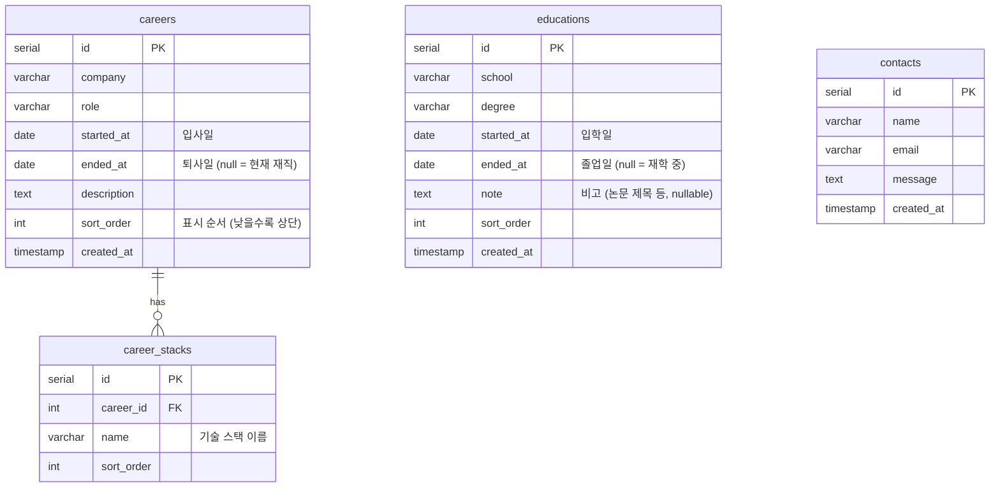

# Portfolio DB ERD

## 테이블 관계도



## 테이블 설명

### careers
경력 항목. `ended_at`이 `NULL`이면 현재 재직 중을 의미한다.

| 컬럼 | 타입 | 설명 |
|------|------|------|
| id | serial | PK |
| company | varchar(100) | 회사명 |
| role | varchar(100) | 직책/역할 |
| started_at | date | 입사일 |
| ended_at | date | 퇴사일 (NULL = 현재 재직) |
| description | text | 업무 설명 |
| sort_order | int | 표시 순서 (낮을수록 상단, default 0) |
| created_at | timestamp | 레코드 생성 시각 |

### career_stacks
경력별 기술 스택. `careers`와 1:N 관계.

| 컬럼 | 타입 | 설명 |
|------|------|------|
| id | serial | PK |
| career_id | int | careers.id FK |
| name | varchar(50) | 기술 스택 이름 (예: Go, Kubernetes) |
| sort_order | int | 표시 순서 (default 0) |

### educations
학력 항목. `ended_at`이 `NULL`이면 재학 중을 의미한다.

| 컬럼 | 타입 | 설명 |
|------|------|------|
| id | serial | PK |
| school | varchar(100) | 학교명 |
| degree | varchar(100) | 전공 및 학위 (예: 컴퓨터공학과 학사) |
| started_at | date | 입학일 |
| ended_at | date | 졸업일 (NULL = 재학 중) |
| note | text | 비고 — 논문 제목 등 (nullable) |
| sort_order | int | 표시 순서 (낮을수록 상단, default 0) |
| created_at | timestamp | 레코드 생성 시각 |

### contacts
문의 폼 제출 내역. 기존 테이블.

| 컬럼 | 타입 | 설명 |
|------|------|------|
| id | serial | PK |
| name | varchar(100) | 발신자 이름 |
| email | varchar(255) | 발신자 이메일 |
| message | text | 문의 내용 |
| created_at | timestamp | 제출 시각 |
```
